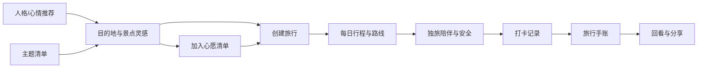
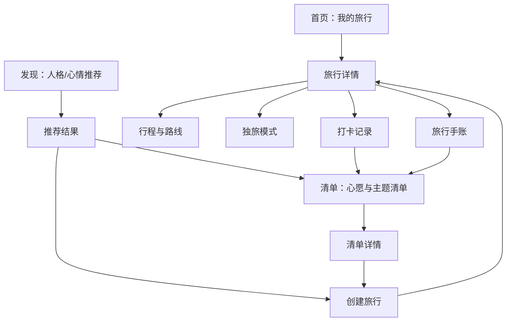

# 旅行产品功能扩展方案

- 版本：V0.1
- 日期：2026-06-22
- 适用阶段：PRD 扩展前方案
- 输出：产品方案

## 升级方向

建议把新功能统一在“旅行人格与愿望清单”这条主线上。独自旅行解决安全感和陪伴感，MBTI/星座/心情推荐提供探索感，心愿清单和关系清单承接用户的收藏、计划和分享。

原产品已经覆盖行程记录、景点路线、打卡和手账。新增功能不应只是继续堆功能，而要让产品变得更有辨识度：用户打开产品时，不只是在管理一次旅行，也是在认识自己适合怎样旅行、想和谁完成哪些旅行、这一生还想去哪些地方。

产品可升级为“旅行记录 + 个性推荐 + 清单驱动”的结构。记录功能解决旅行中和旅行后的使用价值，推荐功能负责旅行前的灵感入口，清单功能负责长期留存。三者连接起来后，用户可以从一个“今天心情不好，想一个人去海边”的念头，进入目的地推荐、景点路线、打卡记录和手账沉淀。

主张一

**独自旅行不是小众补丁**。它是一种明确的用户场景：用户需要安全感、低社交压力、灵活路线和自我记录。

主张二

**人格推荐要像游戏化入口**。MBTI、星座和心情不必被包装成科学结论，而应作为轻松、有趣、可解释的偏好标签。

主张三

**清单是长期关系**。心愿清单、情侣清单、闺蜜清单、亲子清单能让用户在没有旅行时也持续回到产品里。

### 功能分层

| 层级 | 功能方向 | 解决的问题 | 与原 PRD 的关系 |
|----|----|----|----|
| 基础层 | 行程、路线、打卡、手账 | 让用户完成一次旅行记录。 | 沿用原 PRD 主路径。 |
| 灵感层 | MBTI/星座/心情推荐、目的地卡片、美食推荐 | 让用户在不知道去哪时获得轻松的出行灵感。 | 作为旅行创建前的新入口。 |
| 清单层 | 心愿清单、遗愿清单、情侣/闺蜜/亲子清单 | 把一次旅行变成长期愿望管理。 | 清单项目可转化为景点候选和旅行计划。 |
| 陪伴层 | 独旅安全、轻陪伴、独处任务、情绪记录 | 降低独自旅行的不安和孤单感。 | 增强旅行中使用频率。 |

**图示：新功能与原主路径的连接**

## 独自旅行功能

独自旅行用户的需求不只是在行程人数上选择“1 人”。他们更关心几个具体问题：我一个人去是否安全、路线是否太累、能不能避免尴尬、有没有适合独处的体验、发生意外时有没有备用联系人。

### 功能模块

| 模块 | 功能说明 | 优先级 | 产品价值 |
|----|----|----|----|
| 独旅模式 | 创建旅行时选择“独自旅行”，系统自动开启独旅相关设置，包括安全提醒、路线强度提醒、独处体验推荐和紧急联系人入口。 | P0 | 让独旅成为明确场景，而不是普通旅行的子选项。 |
| 安全感设置 | 用户可设置紧急联系人、预计回程时间、夜间提醒和位置分享开关。产品不默认公开位置，只在用户主动开启时分享。 | P0 | 降低独自出行心理负担。 |
| 路线强度提示 | 每日路线根据景点数量、通勤跨度、夜间活动和步行强度，给出“轻松 / 适中 / 偏累”标签。 | P1 | 帮助用户避免把独旅行程排得过满。 |
| 独处友好推荐 | 推荐适合一个人去的咖啡馆、书店、展览、公园、海边、城市漫步路线和小众美食。 | P1 | 形成独旅特色内容资产。 |
| 今日独处任务 | 每天给用户一个低压力任务，例如“拍一张街角照片”“给今天的自己写一句话”“找一家不赶时间的店坐 30 分钟”。 | P1 | 把打卡变成更有情绪价值的记录。 |
| 轻陪伴助手 | 在旅行中提供日程提醒、天气提醒、夜间返回提醒和手账提示。语气要像同行朋友，不像客服机器人。 | P2 | 增强陪伴感，但不应过度打扰。 |

### 独旅体验原则

原则 01

安全功能默认克制，不制造焦虑。提醒应说明具体原因，例如“这段路线预计 22:30 结束，是否提前设置回程提醒”。

原则 02

推荐内容强调独处友好，而不是孤独叙事。产品可以温暖，但不要把独自旅行写成需要被拯救的状态。

原则 03

独旅记录应更重视情绪和自我对话。手账模板可提供“今天我发现了什么”“今天我照顾自己的方式”等引导。

## 特色推荐功能

MBTI、星座和心情适合做成“低门槛、强记忆点”的推荐入口。产品表达上要避免宣称它们能准确预测用户行为，更适合定位为一种趣味化偏好问答：用户用 10 秒选择当下状态，系统生成一组旅行灵感。

### 推荐入口

| 入口类型 | 用户输入 | 推荐输出 | 示例文案 |
|----|----|----|----|
| MBTI 旅行人格 | 16 型人格，或用简短问答推断偏好。 | 目的地类型、景点节奏、美食风格、适合同行关系。 | “INFP 的慢旅行：海边、小书店、能发呆的咖啡馆。” |
| 星座旅行灵感 | 星座、旅行月份、想要的氛围。 | 季节目的地、仪式感活动、适合拍照的景点。 | “天秤座的周末：漂亮街区、设计酒店、甜品和展览。” |
| 心情推荐 | 当前心情，如疲惫、兴奋、失恋、想逃离、想庆祝。 | 旅行地、美食、路线强度和手账主题。 | “今天适合低能量出走：温泉、湖边、热汤和早睡。” |
| 关系推荐 | 独旅、情侣、闺蜜、亲子、家人、同事。 | 清单模板、目的地组合、避坑提醒和拍照任务。 | “第一次情侣旅行：少排队、多散步、保留各自休息时间。” |
| 预算与时间 | 预算范围、旅行天数、出发城市。 | 更可落地的目的地和路线。 | “两天一夜、低预算、从上海出发：湖州 / 绍兴 / 苏州。” |

### 推荐逻辑

推荐系统可以先用规则和内容标签实现，不必一开始就做复杂算法。每个目的地、景点和美食都需要打上标签，例如“独处友好”“适合拍照”“低体力”“夜间谨慎”“亲子友好”“适合雨天”“适合疗愈”“高预算”“排队风险”。用户输入的 MBTI、星座和心情会被转化为一组偏好标签，再与内容标签匹配。

| 用户信号 | 转化后的偏好标签 | 适合推荐 | 不宜推荐 |
|----|----|----|----|
| 独自旅行 + 疲惫 | 低体力、低社交、安静、交通方便 | 温泉、湖边城市、咖啡馆、短步行路线 | 夜爬、特种兵路线、强社交活动 |
| ENFP + 想认识新朋友 | 高互动、城市探索、活动密集 | 市集、音乐节、城市漫步、青旅活动 | 过于封闭、交通不便的单点行程 |
| 巨蟹座 + 亲子 | 温和、安全、亲密、低风险 | 海洋馆、亲子酒店、农场、慢节奏小城 | 长排队、高强度徒步、夜间转场 |
| 失恋 / 想重启 | 疗愈、独处、自然、低刺激 | 海边、森林、书店、手作体验 | 情侣打卡点、强社交聚会 |
| 情侣纪念日 | 仪式感、拍照、餐厅、日落 | 观景餐厅、海边酒店、夜景路线、纪念照任务 | 过累路线、拥挤景区、需要早起排队的安排 |

### 推荐结果结构

推荐卡片

每张推荐卡应包含目的地名称、推荐理由、适合人群、预计预算、适合天数、推荐季节和风险提示。推荐理由需要可解释，例如“因为你选择了低能量和独自旅行，所以优先推荐交通方便、活动密度低的目的地”。

转化动作

推荐结果不应停在浏览。每张卡片需要提供“加入心愿清单”“生成两日路线”“加入某次旅行”“换一批”“不喜欢这个理由”等操作，用于把灵感转成计划。

**图示：推荐信号优先级建议**

## 主题清单体系

清单是这个产品最适合沉淀长期愿望的功能。它可以把“以后想去”变成一个持续增长的个人旅行资产，也能让不同关系产生不同的旅行玩法。

### 清单类型

| 清单 | 定位 | 内置内容 | 适合玩法 | 优先级 |
|----|----|----|----|----|
| 心愿清单 | 用户长期想去的地方。 | 目的地、景点、美食、酒店体验、季节活动。 | 收藏、排序、标记想去程度、转成旅行计划。 | P0 |
| 人生清单 | 更有仪式感的人生体验列表。 | 看极光、住一次海边小屋、坐一次观光火车、完成一次独旅。 | 完成后生成纪念手账，适合年度回顾。 | P1 |
| 独旅清单 | 为独自旅行准备的安全、轻松、有陪伴感的清单。 | 一个人友好餐厅、城市漫步、疗愈目的地、低风险路线。 | 从心情出发选择路线。 | P0 |
| 情侣旅行清单 | 为两个人制造共同记忆。 | 日落、温泉、纪念餐厅、海边、城市夜景、拍照点。 | 共同收藏、完成纪念日路线、生成双人手账。 | P1 |
| 闺蜜旅行清单 | 强调拍照、聊天、购物、美食和轻松体验。 | 甜品店、买手店、展览、拍照街区、轻奢酒店。 | 共同投票选择目的地。 | P1 |
| 亲子旅行清单 | 强调安全、节奏、教育和便利。 | 博物馆、自然营地、农场、动物园、亲子酒店。 | 按年龄段推荐路线。 | P2 |
| 美食清单 | 把吃作为旅行动机。 | 地方小吃、早餐、夜市、咖啡、甜品、老字号。 | 从美食反向生成路线。 | P1 |

### 清单内置推荐

内置清单不宜只是固定模板，而应是“模板 + 可替换推荐”。例如情侣旅行清单里可以有“看一次日落”“一起吃一顿当地早餐”“拍一张不看镜头的照片”等任务；当用户选择目的地后，系统再把这些任务替换成当地的景点、美食和路线。

独旅清单样例

找一家安静咖啡馆走一段河边路线给自己买一束花写一张明信片早睡一次

情侣清单样例

一起看日落拍一张合照交换当天最喜欢的瞬间吃一顿纪念日晚餐

亲子清单样例

认识一种动物收集一张地图完成自然观察选一个孩子决定的景点

### 清单状态

| 状态 | 说明 | 允许操作 |
|----|----|----|
| 想去 | 用户收藏了目的地、景点、美食或任务。 | 排序、添加备注、设置优先级、加入旅行。 |
| 计划中 | 清单项已被加入某次旅行或路线。 | 查看关联旅行、调整日期、取消关联。 |
| 已完成 | 清单项已通过打卡或手动标记完成。 | 写完成感想、加入手账、生成纪念卡。 |
| 暂时放弃 | 用户决定以后不去了或条件不适合。 | 恢复、删除、写原因。 |

## 产品结构

扩展后的产品可以形成四个主入口：首页继续承接旅行列表；推荐页负责灵感发现；清单页负责长期愿望；旅行详情页承接执行和记录。

**图示：扩展后的信息架构**

### 模块关系

| 对象 | 关键字段 | 与其他对象关系 |
|----|----|----|
| 推荐画像 | MBTI、星座、心情、关系、预算、天数、出发城市、偏好标签 | 用于生成推荐结果，可保存到用户偏好。 |
| 推荐结果 | 目的地、景点、美食、推荐理由、标签、预算、适合天数、风险提示 | 可加入清单，也可直接创建旅行。 |
| 清单 | 清单类型、名称、成员、可见性、排序规则 | 包含多个清单项，可关联旅行和手账。 |
| 清单项 | 地点/任务/美食、状态、想去程度、备注、完成时间 | 可转成景点候选、打卡记录或手账素材。 |
| 独旅设置 | 紧急联系人、位置分享、夜间提醒、路线强度偏好 | 绑定旅行，也可作为用户默认设置。 |

## 页面草图

发现 · 心情推荐

心情MBTI星座

**今天的状态**
想逃离城市 · 低能量 · 一个人

**推荐主题**
“去一个能慢下来的地方”
湖边温泉书店

生成推荐

独旅模式

**路线强度**
今日 4 个点 · 步行偏多 · 建议减少 1 个景点

**安全设置**
紧急联系人：已设置
夜间返回提醒：21:30

**今日独处任务**
找一处能坐 20 分钟的地方，写下今天最舒服的瞬间。

开始今日路线

我的清单

**人生清单**
已完成 3 / 28
极光海边小屋

**情侣旅行清单**
已完成 7 / 20
日落纪念日晚餐

**独旅清单**
已完成 5 / 18
咖啡馆城市漫步

新建清单

**图示：新增功能核心页面草图**

## 版本节奏

建议先做能和原 PRD 主路径直接相连的功能，避免一开始陷入复杂推荐算法或内容社区。第一阶段用规则推荐和内置清单验证用户是否喜欢这种产品性格。

| 阶段 | 目标 | 功能范围 | 不做什么 |
|----|----|----|----|
| MVP 扩展 | 让用户从灵感进入旅行计划。 | 独旅模式、心情推荐、基础心愿清单、独旅清单、推荐结果加入旅行。 | 不做 AI 深度对话、不做开放社区、不做多人实时协作。 |
| Beta | 让清单成为长期留存入口。 | 情侣清单、闺蜜清单、美食清单、清单完成纪念卡、手账关联清单。 | 不做复杂榜单和达人内容分发。 |
| 增长版 | 让推荐更个性化。 | MBTI/星座入口、偏好学习、换一批理由反馈、目的地内容包。 | 不把 MBTI 和星座包装成严肃判断。 |
| 成熟版 | 形成可持续内容体系。 | 城市清单包、季节清单包、官方编辑推荐、用户私密清单分享。 | 谨慎开放公开社区，先保护记录工具定位。 |

### MVP 功能优先级

**图示：功能价值与实现复杂度对比**

## 边界风险

| 风险 | 表现 | 处理建议 |
|----|----|----|
| 人格推荐被理解为伪科学 | 用户可能质疑 MBTI、星座推荐的可信度。 | 产品表达为“灵感玩法”和“偏好标签”，不声称准确预测用户。 |
| 清单过多导致混乱 | 用户不知道该进哪个清单，收藏分散。 | 默认只展示 3 到 4 个核心清单，其他作为模板库按需创建。 |
| 独旅安全责任边界 | 安全提醒可能被误认为平台承诺。 | 明确是辅助提醒，保留用户自主设置，不承诺实时救援。 |
| 推荐内容质量不足 | 推荐目的地重复、理由空泛、地点不适合。 | 先做小范围城市和主题内容包，保证每条推荐有可解释理由。 |
| 产品变得太娱乐化 | 原有记录和管理功能被弱化。 | 推荐和清单都必须能转化为行程、打卡或手账，不做纯测试页面。 |

### 待确认问题

- 产品更想走“温暖陪伴”还是“高效旅行工具”路线？这会影响文案、推荐卡片和独旅助手的语气。
- 首批内容城市要选择哪些？建议从用户熟悉且内容丰富的城市开始，例如上海、杭州、成都、京都、曼谷等。
- 是否允许用户与他人共享清单？情侣、闺蜜、亲子清单若支持共同编辑，会明显增加协作和权限复杂度。
- 推荐功能是否需要 AI 文案生成？如果做，建议先用于生成推荐理由和手账引导，不直接生成不可验证的地点信息。
