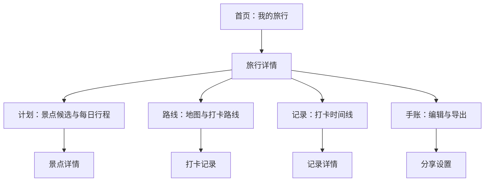
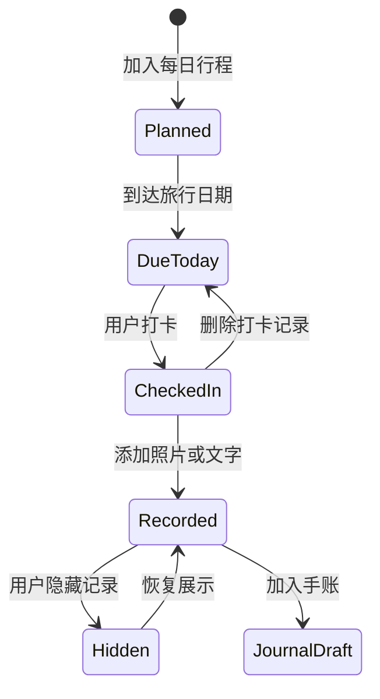

# 旅行记录与手账产品 PRD

- 版本：V0.1
- 日期：2026-06-21
- 阶段：0 到 1 产品构想
- 状态：草案，待确认

## 产品判断

核心假设：用户不是缺少旅行工具，而是缺少一个能把“想去哪里、实际去了哪里、最后留下什么”串起来的个人旅行空间。第一版不追求复杂订票和交易，而是先做好行程、路线、打卡、手账四件事。

### 需求识别

| 维度 | 判断 | 依据 |
|----|----|----|
| 需求类型 | 0 到 1 消费级互联网产品 | 用户只有初步产品方向，没有既有系统或改版约束。 |
| 复杂度 | 中高复杂度 | 涉及旅行前、中、后三段流程，并包含路线、地图、内容编辑、相册素材与分享。 |
| 目标读者 | 产品、设计、前端、后端、QA | 文档需要支持后续直接进入 vibe coding 与原型实现。 |
| 行业 | 旅行工具 + 个人内容管理 | 功能横跨行程规划、旅行记录和手账创作。 |
| 风险水平 | 中等 | 地图定位、隐私、内容编辑体验和离线可用性会影响核心体验。 |

### 产品定位

产品暂定名为 **旅迹手账**。它不是重交易的旅行平台，也不是单纯的日记工具，而是一个以“旅行”为单位管理个人记忆的工具。用户可以在出发前收集想去的景点，安排每天的路线；旅行中用位置、照片、文字和心情完成打卡；旅行后把这些素材整理成一篇可回看、可分享、可导出的旅行手账。

MVP 阶段的边界要保持克制：不做机酒预订、不做复杂社交关系、不做达人内容社区。这些功能容易扩大工程量，也会把产品拉向交易或社区平台。第一版先验证用户是否愿意持续用一个工具记录完整旅行。

### 问题背景

Pain 01

**计划分散**。景点收藏在地图、攻略平台、聊天记录和备忘录里，出发前难以整理成可执行路线。[PM 假设]

Pain 02

**旅途中记录断裂**。用户拍了照片、发了朋友圈，但地点、时间、路线和当时想法没有自动连在一起。[PM 假设]

Pain 03

**旅行后沉淀成本高**。写游记需要重新翻相册、找地点、回忆顺序，很多旅行记忆停留在未整理状态。[PM 假设]

### 竞品观察

公开信息显示，Wanderlog 主打旅行计划、地图、航班酒店预订信息和日程管理等能力[1]；Polarsteps 强调旅行规划、轨迹记录和旅程回看，并公开宣称服务大量旅行者[2]；TripIt 聚焦自动组织旅行行程和旅行提醒[3]；Day One 作为日记工具支持照片、视频、绘画、音频和隐私保护等能力[4]；马蜂窝更偏攻略、景点图片、游记和交通美食购物信息社区[5]。这些产品分别覆盖了计划、轨迹、行程聚合、日记和攻略社区，但“从计划到打卡再到手账”的一体化体验仍有差异化空间。

| 产品 | 公开定位 | 对本产品的启发 | 可避开的方向 |
|----|----|----|----|
| Wanderlog | 旅行计划、行程和地图工具 | 计划与地图需要深度结合，路线不是附属功能。 | 避免第一版做过重的协作和预订管理。 |
| Polarsteps | 旅行规划、轨迹记录、旅程回看 | 旅行记录可以自动生成时间线，降低用户补录成本。 | 不要把轨迹记录做成唯一核心，否则手账创作空间不足。 |
| TripIt | 自动组织旅行行程 | 结构化行程对商务和长途旅行很有价值。 | 邮箱导入、票务解析可后置，MVP 先手动创建。 |
| Day One | 多媒体日记与个人数据保护 | 手账编辑需要支持照片、文字、音频和隐私设置。 | 不要做泛日记，旅行语境必须足够强。 |
| 马蜂窝 | 攻略、图片、游记和自由行信息社区 | 游记内容和地点信息可以互相补充。 | 第一版不做开放社区，避免审核和冷启动压力。 |

**图示：MVP 功能优先级建议**

## 用户与场景

第一版服务对象不应定义为“所有旅行用户”。更合适的切口是：一年有 2 次以上自由行、愿意拍照记录、会在旅行前收藏攻略但不一定擅长整理的人。

| 角色 | 典型特征 | 高频场景 | 痛点强度 | MVP 价值 |
|----|----|----|----|----|
| 独立旅行者 | 自己规划路线，偏好自由行，常在手机上查攻略和地图。 | 出发前收集景点；当天根据体力调整路线；晚上整理照片。 | 高 | 用一个旅行空间替代备忘录、地图收藏和相册筛选。 |
| 情侣或朋友小团体 | 一起出行，路线由 1 人主导，其他人参与选择。 | 投票选择景点；共享当天路线；旅行后共同补充照片和文字。 | 中 | MVP 可先做只读分享，协作编辑后置。 |
| 轻内容创作者 | 愿意产出图文游记，但不一定追求公开流量。 | 旅行后整理为图文手账，导出图片或链接分享到社交平台。 | 中高 | 用自动时间线和模板减少排版工作。 |
| 本地周末探索用户 | 短途出行频率高，每次行程较短。 | 周末选择 2 到 4 个点打卡，记录咖啡馆、展览、公园等。 | 中 | 短行程是留存入口，适合验证低成本记录。 |

### 核心场景

Before Trip

**旅行前准备**：用户创建一次旅行，输入目的地和日期，把攻略里看到的景点加入候选池，按兴趣、距离、开放时间和预计耗时安排到不同日期。

During Trip

**旅行中打卡**：用户打开当天路线，查看下一站，抵达景点后一键打卡，补充照片、文字和心情；如果当天临时改路线，系统保留原计划和实际轨迹差异。

After Trip

**旅行后手账**：系统按时间、地点和照片自动生成草稿，用户调整标题、段落、封面和模板，形成一篇完整手账。

Share

**回看与分享**：用户在旅行主页查看地图足迹、时间线和手账，也可以导出长图或分享只读链接给同行者。

**图示：用户旅程与产品介入点**

## MVP 范围

第一版目标是验证“旅行空间”能否成为用户持续记录一段旅程的主入口。功能选择以降低记录成本和提高回看价值为优先。

| 范围 | 包含内容 | 不包含内容 | 说明 |
|----|----|----|----|
| P0 | 旅行创建、景点候选、每日行程、路线地图、景点打卡、图文记录、手账草稿、只读分享 | 机酒预订、支付、开放社区、复杂协作 | 支持从计划到手账的主路径。 |
| P1 | 路线排序建议、开放时间提醒、照片按地点归组、手账模板、导出长图 | AI 自动生成完整攻略、跨平台导入 | 提高完成效率，但不阻断主路径。 |
| P2 | 同行者协作编辑、旅行预算、票据收纳、AI 文案润色、公开游记广场 | 交易闭环、达人变现 | 等核心留存被验证后再进入。 |

### 信息架构

**图示：产品信息架构**

## 功能需求

### 功能总览

| \# | 模块 | 功能描述 | 优先级 |
|----|----|----|----|
| F1 | 首页与旅行列表 | 展示用户创建的所有旅行，按“即将出发、进行中、已完成”分组。每个旅行卡片展示目的地、日期、完成进度、最近一次记录和封面。空状态提供“创建第一次旅行”入口，并说明产品能管理路线、打卡和手账。 | P0 |
| F2 | 创建旅行 | 用户输入旅行名称、目的地、开始日期、结束日期、同行者昵称和旅行可见性。目的地和日期为必填；结束日期不得早于开始日期；未设置封面时使用目的地默认图形占位。创建后进入旅行详情页。 | P0 |
| F3 | 景点候选池 | 用户可手动添加景点，字段包含名称、地址、标签、预计停留时长、开放时间、备注和想去程度。景点可被加入某一天，也可保持未安排状态。缺少地址时允许保存，但地图路线功能需要提示“该景点无法参与路线计算”。 | P0 |
| F4 | 每日行程 | 用户按日期查看计划，拖动调整景点顺序，为每个景点设置预计到达时间和停留时长。系统展示当日景点数量、预计总耗时和未安排景点。若行程时间冲突，显示提醒但不阻止保存。 | P0 |
| F5 | 路线地图 | 根据当天已安排且有地址的景点展示地图路线。用户可切换步行、公共交通、驾车三种出行方式。路线计算失败时保留景点顺序，并提示用户手动查看地图或重新填写地址。 | P0 |
| F6 | 景点打卡 | 用户在当天路线或景点详情中点击打卡，系统记录时间、地点、关联景点和可选定位。用户可补充照片、文字、心情、消费金额和同行者。打卡完成后，该景点状态变为“已到达”。 | P0 |
| F7 | 旅行时间线 | 按时间顺序聚合打卡、照片和文字记录，并区分“计划点”和“实际打卡点”。用户可以编辑记录、补录未打卡地点、隐藏不想展示的记录。时间线是手账生成的主要素材来源。 | P0 |
| F8 | 手账编辑器 | 系统基于时间线生成手账草稿，结构包含封面、旅行摘要、每日段落、地点卡片和照片拼贴。用户可以调整模板、标题、段落顺序、照片展示和隐私信息。编辑器需要支持自动保存。 | P0 |
| F9 | 分享与导出 | 用户可将手账导出为长图或生成只读链接。分享前必须进入预览页，用户可选择是否显示具体定位、同行者、消费金额和未公开备注。默认不显示精确地址和私密备注。 | P1 |
| F10 | 搜索与筛选 | 在旅行内按景点名、标签、日期和记录内容搜索。筛选结果可跳转到景点详情、时间线记录或手账段落。 | P1 |
| F11 | 提醒与异常提示 | 提供开放时间冲突、路线计算失败、定位权限关闭、照片权限关闭、离线保存失败等提示。提示用可理解语言说明影响，并给出继续操作或稍后补充的入口。 | P1 |
| F12 | 同行者只读分享 | 旅行创建者可分享行程只读链接给同行者。被分享者无需注册也能查看路线和手账预览，但不能编辑。链接可随时关闭。 | P1 |

### 核心页面原型

我的旅行 F1

**京都三日**
2026.10.02 - 10.04
进行中 · 6/12 已打卡

**云南夏天**
2026.08.11 - 08.17
即将出发 · 18 个候选景点

**成都周末**
已完成
手账待整理

创建旅行 F2

京都三日 · 路线 F4/F5

D1D2D3

**09:30 清水寺**
预计停留 90 分钟 · 已有地址
调整顺序

**12:00 二年坂**
午餐和拍照 · 时间冲突提醒

**15:30 鸭川**
可步行到达 · 待打卡

手账草稿 F8/F9

**封面**
京都三日 · 12 张精选照片

**D1 清水寺到鸭川**
系统已从 3 个打卡点生成段落，可编辑文字和照片顺序。

**隐私预览**
精确地址：隐藏 · 消费：隐藏 · 同行者：显示昵称

导出长图 生成只读链接

**图示：三个核心移动端页面草图**

### 模块细则

#### 旅行创建与首页 F1/F2

**业务逻辑：**用户第一次进入首页时展示空状态，点击创建后进入表单。表单保存成功后生成一个旅行对象，默认状态为“即将出发”；当前日期落在旅行日期范围内时状态自动变为“进行中”；结束日期之后若至少存在 1 条打卡或手账草稿，则状态变为“已完成”。

**交互逻辑：**点击创建旅行后进入表单；必填字段不完整时主按钮置灰；保存中显示加载状态；保存失败时保留用户已输入内容，并显示重试入口。

**字段约束：**旅行名称 1 到 40 个字符；目的地 1 到 60 个字符；开始日期必填；结束日期可为空，若为空则默认单日旅行；可见性默认“仅自己可见”。

#### 景点候选与每日行程 F3/F4

**业务逻辑：**景点先进入候选池，再被安排到某一天。一个景点可重复加入不同日期，但系统需提示“该景点已在 D2 安排过”。从某日移除景点时，景点仍保留在候选池，不删除原始资料。

**交互逻辑：**用户点击“添加景点”打开表单；在每日行程中拖动卡片改变顺序；点击时间字段可设置预计到达时间；点击“加入当天”后，景点从未安排列表移动到当天列表。

**异常与边界：**开放时间缺失时不做冲突判断；地址缺失时不参与路线；当天景点超过 10 个时显示“行程可能过满”的提醒，但允许继续。

#### 路线地图与打卡 F5/F6

**业务逻辑：**路线由当天已安排且有地址的景点组成。用户打卡时，系统创建一条记录，并关联旅行、日期、景点、时间和素材。若用户没有授权定位，可以手动完成打卡，但记录标记为“未验证位置”。

**交互逻辑：**在路线页点击景点卡片进入详情；点击“打卡”打开记录面板；上传照片后可继续添加文字；保存成功后返回路线页，景点状态更新为“已到达”。

**状态流转：**未安排 → 已计划 → 当天待到达 → 已到达 → 已记录。若用户删除打卡记录，景点回到“当天待到达”，但计划顺序不变。

#### 时间线与手账 F7/F8/F9

**业务逻辑：**时间线按打卡时间排序，手账草稿从时间线中读取可展示记录。隐藏记录不出现在分享页和导出图中，但仍保留在用户私有时间线。手账草稿首次生成后与时间线保持关联，新打卡记录进入“可加入手账”的待处理区。

**交互逻辑：**用户进入手账页时，若尚无草稿，显示“一键生成草稿”；生成后进入编辑器。编辑器支持调整段落顺序、替换封面、隐藏地点、删除照片。退出编辑器时自动保存，保存失败需要在顶部显示提示。

**隐私规则：**分享前必须显示预览。默认隐藏精确地址、消费金额、未公开备注；用户主动开启后才展示。只读链接关闭后，访问者看到“链接已失效”。

### 状态与异常

**空状态**

无旅行、无景点、无打卡、无手账时分别显示不同文案和下一步入口。

**加载状态**

地图、路线、图片上传和手账生成需要显示加载中，避免用户重复点击。

**失败状态**

网络失败、路线失败、上传失败都要保留用户输入，并支持重试或稍后保存。

**权限状态**

定位、相册权限关闭时说明影响，并提供手动记录入口。

**图示：打卡记录状态机**

## 指标与埋点

第一版指标不应只看下载或注册，而要观察用户是否真的完成了一次旅行记录。核心指标建议定义为：完成旅行记录的旅行数，即一个旅行中至少有 1 天行程、3 个景点、2 次打卡和 1 份手账草稿。

| 事件名 | 触发时机 | 关键属性 | 用途 |
|----|----|----|----|
| `trip_create_success` | 用户成功创建旅行 | 目的地、旅行天数、是否添加同行者 | 判断创建入口和表单是否顺畅。 |
| `spot_add_success` | 景点保存成功 | 来源、是否有地址、标签、预计停留时长 | 判断候选池是否被使用，以及地址缺失比例。 |
| `itinerary_day_save` | 每日行程保存 | 日期、景点数、是否时间冲突、是否拖动排序 | 判断用户是否把收藏转化为可执行路线。 |
| `route_view` | 打开路线地图 | 交通方式、路线点数、是否计算成功 | 识别地图路线的真实使用率和失败原因。 |
| `checkin_create_success` | 打卡保存成功 | 是否定位、照片数、文字长度、是否关联景点 | 衡量旅行中记录的完成质量。 |
| `journal_generate` | 生成手账草稿 | 记录数、照片数、模板类型 | 观察时间线是否能转化为内容沉淀。 |
| `journal_export` | 导出或分享手账 | 导出类型、隐私选项、是否只读链接 | 判断用户是否认可最终内容价值。 |

### 阶段目标

由于当前没有真实用户数据，以下仅作为 MVP 观察口径，具体目标值需要在内测后确认。

Activation

创建旅行后 24 小时内添加至少 3 个景点的用户占比。[待确认]

Engagement

进行中旅行里，每天至少产生 1 条打卡记录的旅行占比。[待确认]

Output

旅行结束后 7 天内生成手账草稿的旅行占比。[待确认]

## 体验与安全要求

| 类别 | 要求 | 说明 |
|----|----|----|
| 性能 | 首页和旅行详情首屏在常规网络下尽量控制在 2 秒内可操作；地图和图片可分阶段加载。 | 旅行中使用场景通常碎片化，等待过长会降低记录意愿。 |
| 离线可用 | 创建打卡记录、输入文字、选择本地照片应支持本地暂存；网络恢复后再同步。 | 景区、国外旅行和地铁场景可能网络不稳定。 |
| 隐私 | 精确定位、消费金额、同行者和私密备注默认不公开；分享前必须预览。 | 旅行记录包含敏感个人轨迹，默认策略应偏保守。 |
| 数据保留 | 删除旅行前二次确认；删除后进入短期可恢复状态，恢复期限待产品策略确认。 | 避免误删整段旅行记忆。 |
| 可访问性 | 核心按钮和文字对比度达到可读标准，主要流程不依赖颜色单独表达状态。 | 路线状态需同时使用文字说明。 |
| 合规 | 首次使用定位、相册、分享链接前说明用途；用户可随时关闭分享链接。 | 具体隐私政策与用户协议需法务确认。 |

## 路线与风险

### 版本路线

| 阶段 | 目标 | 核心能力 | 进入下一阶段的信号 |
|----|----|----|----|
| MVP | 跑通计划、打卡、手账主路径 | 旅行创建、景点候选、每日行程、路线地图、打卡、时间线、手账草稿、导出 | 内测用户能在无引导情况下完成一次旅行记录。 |
| Beta | 提升记录效率和分享意愿 | 照片自动归组、模板库、路线建议、同行者只读分享、长图导出优化 | 手账生成和导出行为稳定出现。 |
| 正式版 | 形成可持续使用的旅行记忆库 | 多设备同步、协作编辑、预算与票据、AI 文案润色、年度足迹回顾 | 用户开始复用历史旅行和创建下一次旅行。 |
| 增长版 | 探索内容分发和商业化 | 公开游记、目的地模板、攻略复用、轻量推荐、会员模板 | 私密记录的价值已成立，再考虑公开内容。 |

### 主要风险

| 风险 | 影响 | 建议处理 |
|----|----|----|
| 地图路线能力依赖外部服务 | 路线失败会影响旅行中使用。 | MVP 保留手动排序和地址缺失提示，路线失败不阻断打卡。 |
| 手账编辑器工程量偏大 | 容易拖慢第一版。 | 先做固定模板和有限编辑，不做自由画布。 |
| 记录成本仍然过高 | 用户旅行中可能不愿频繁输入。 | 打卡只要求一键完成，文字和照片允许后补。 |
| 隐私边界不清 | 用户可能不敢分享或误分享敏感信息。 | 默认隐藏敏感字段，分享前强制预览。 |
| 范围膨胀到攻略社区或交易平台 | 产品定位失焦。 | 第一版所有功能围绕个人旅行空间，不建设开放社区。 |

## 验收标准

以下标准用于判断 MVP 是否达到可内测状态。它们描述产品表现，不限定具体技术实现。

| 模块 | 验收标准 |
|----|----|
| 旅行创建 | 用户能在 1 分钟内创建旅行；必填字段校验明确；保存失败不丢失已填内容。 |
| 景点与行程 | 用户能添加景点、安排到某一天、调整顺序，并看到未安排景点；地址缺失时有明确提示。 |
| 路线地图 | 有地址的景点能在地图中展示；路线计算失败时不影响查看景点顺序和继续打卡。 |
| 打卡记录 | 用户能完成一键打卡，并可补充照片和文字；定位权限关闭时仍能手动记录。 |
| 时间线 | 打卡记录按时间排序，用户能编辑、隐藏和补录记录；隐藏记录不进入分享和导出结果。 |
| 手账 | 系统能基于时间线生成草稿；用户能修改标题、封面、段落顺序和照片；退出后内容自动保存。 |
| 分享 | 分享前能预览隐私字段；默认隐藏精确地址、消费金额和私密备注；关闭链接后外部访问失效。 |
| 数据 | 核心事件可被记录，事件字段能支持创建、计划、打卡、生成手账和导出漏斗分析。 |

## 待确认问题

以下问题会影响后续设计和开发取舍，建议在进入代码实现前确认。

- 产品首发形态是移动 Web、iOS/Android App，还是桌面优先的 Web 应用？这会影响地图、相册、定位和离线能力。
- 地图服务选择、路线能力和境内外可用范围需要确认。不同服务在地址搜索、路线规划、费用和许可上差异较大。
- 手账导出的首选格式是长图、PDF、网页链接，还是多格式并存？MVP 建议先做长图和只读链接。
- 是否要从第一版支持账号系统和云同步？如果只做本地原型，隐私和同步逻辑可以后置；如果要真实上线，账号与数据安全需要提前设计。
- 是否引入 AI 能力，例如路线建议、手账润色、照片摘要？若引入，需要额外定义质量评估、失败兜底和成本上限。
